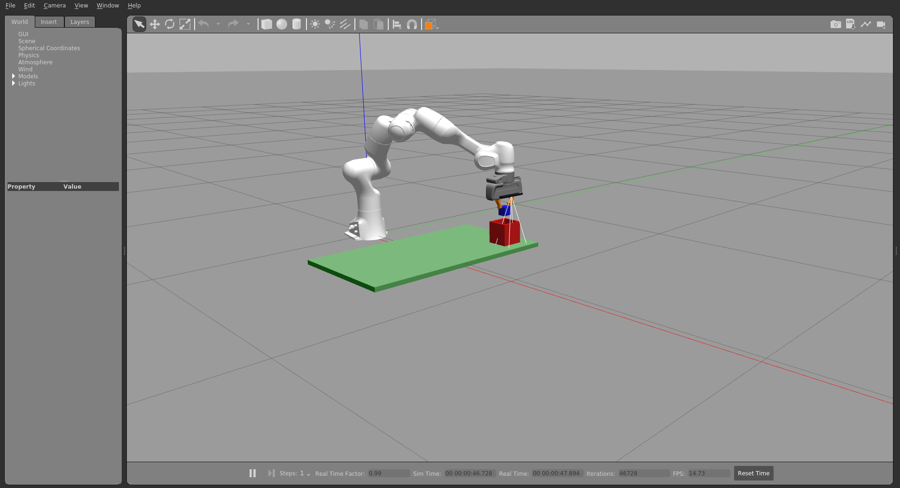
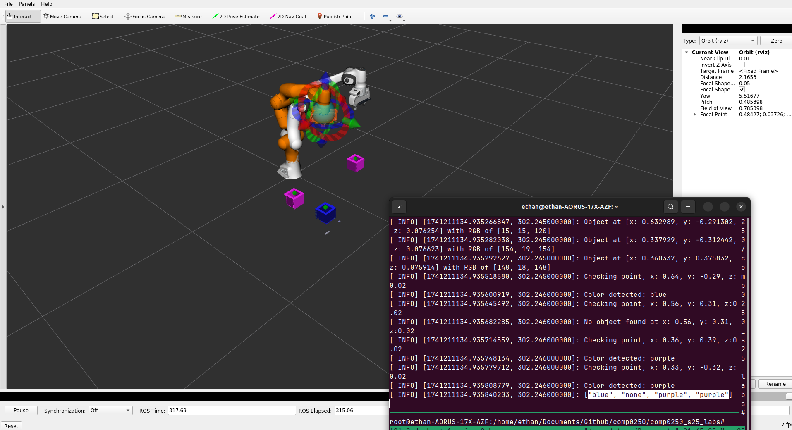
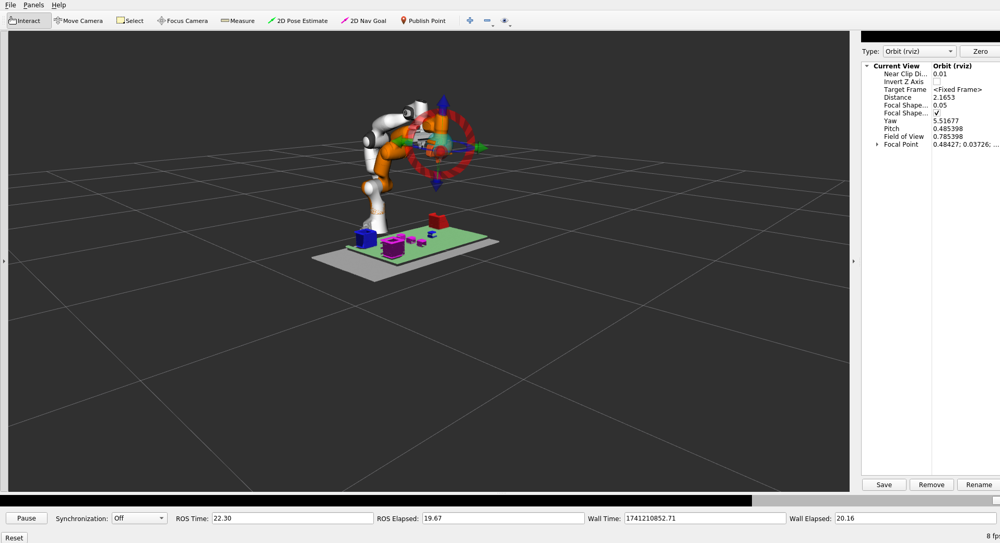

Authors: Ethan D'Souza, Ramneek Ahluwalia (cw1_team_13)

Description: This package contains the solution for COMP0250 coursework 1 - Pick and Place, Object Detection and Localization
 
Contribution: Task 1 (E:50%/ R:50%), Task 2 (E:50%/ R:50%), Task 3 (E:60%/R:40%)

Total number of hours contributed: 30hrs each


## Running solution
To run the solution execute the following command in the terminal this will bring up two nodes, the trajectory and pointcloud node. The pointcloud node is used for scanning the environment and extracting relevant object information such as locations and color information. 
```bash
roslaunch cw1_team_13 run_solution.launch
```

## Task 1

```bash
rosservice call /task 1 
```




## Task 2
```bash
rosservice call /task 2 
```




## Task 3
This task first makes a service call to the pointcloud node to take a scan of the environment using the PCL library. We take multiple scans, get the transformation from the camera frame to the world frame and apply the transformation across scans to build a complete point cloud of the map. To save on computational costs we also voxelize these point clouds and finally publish the pointcloud and centroid of the object locations in RViz under the /pclPoints and /objectPositions topics.
```bash
rosservice call /task 3 
```


